📖 Project Description
Clarify AI isn't just another chatbot. It is a high-performance Decision Coaching Platform designed to solve the "Paradox of Choice."
Most AI tools provide generic answers to complex life questions. Clarify AI reverses the flow. Instead of giving immediate (and often shallow) advice, it utilizes Iterative Inquiry. It asks personalized, context-aware follow-up questions to understand your unique situation before generating a structured, data-driven recommendation.
Whether you are a career switcher, an entrepreneur, or a student, Clarify AI transforms uncertainty into a documented, actionable roadmap.
🚀 Live Demo
Experience the clarity: https://clarify-ai-mocha.vercel.app/
💻 GitHub Repository
Source Code: https://github.com/qasimbsf24003897/Clarify-AI.git
✨ Features
🧠 AI Decision Analysis: Advanced reasoning powered by Llama 3.3 70B via Groq for sub-second latency.
❓ Iterative Inquiry: Personalized follow-up questions that dig deeper into your specific constraints.
📊 Confidence & Risk Meters: Visual data visualization to quantify the viability of your decision.
🗺️ Roadmap Generator: A step-by-step execution plan for your chosen path.
📂 Decision History: Persistent storage to track how your thinking evolves over time.
📄 PDF Report Generation: Professional, exportable reports for offline review or sharing with mentors.
🎙️ Voice Input: Hands-free decision brainstorming for the modern professional.
📱 Responsive Design: Premium UI/UX experience across mobile, tablet, and desktop.
📸 Screenshots
The Journey to Clarity
## 📸 Screenshots

### 1. Landing Page
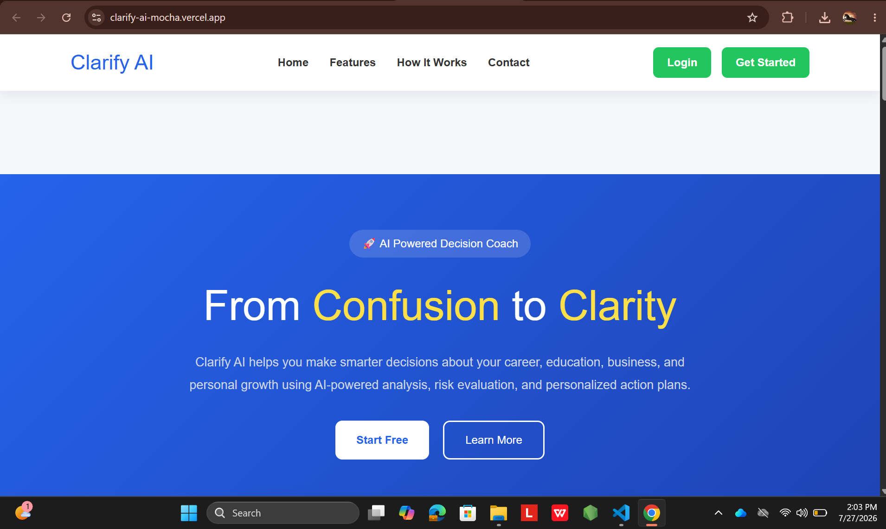

### 2. Decision Input
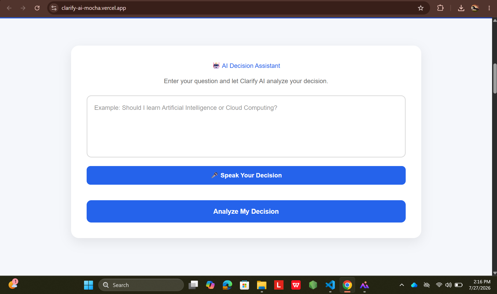

### 3. Follow-up Questions
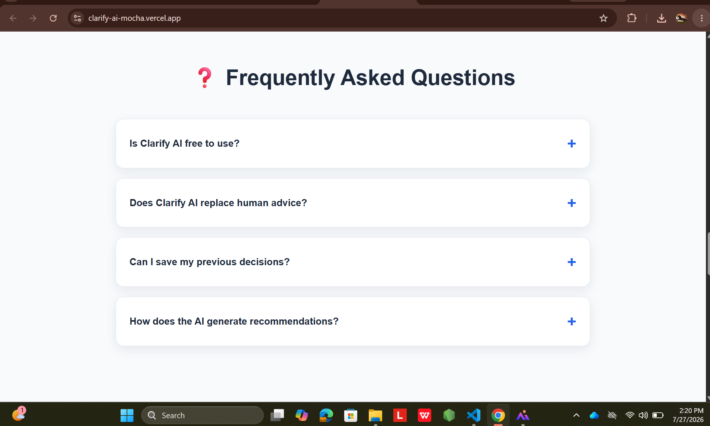

### 4. Analysis Result
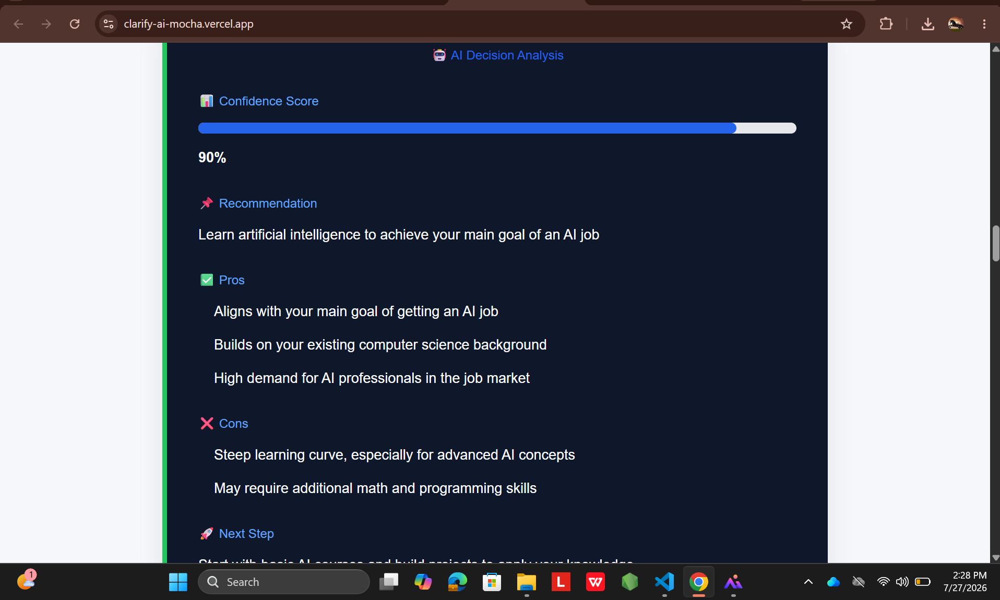

### 5. Confidence & Risk Meter
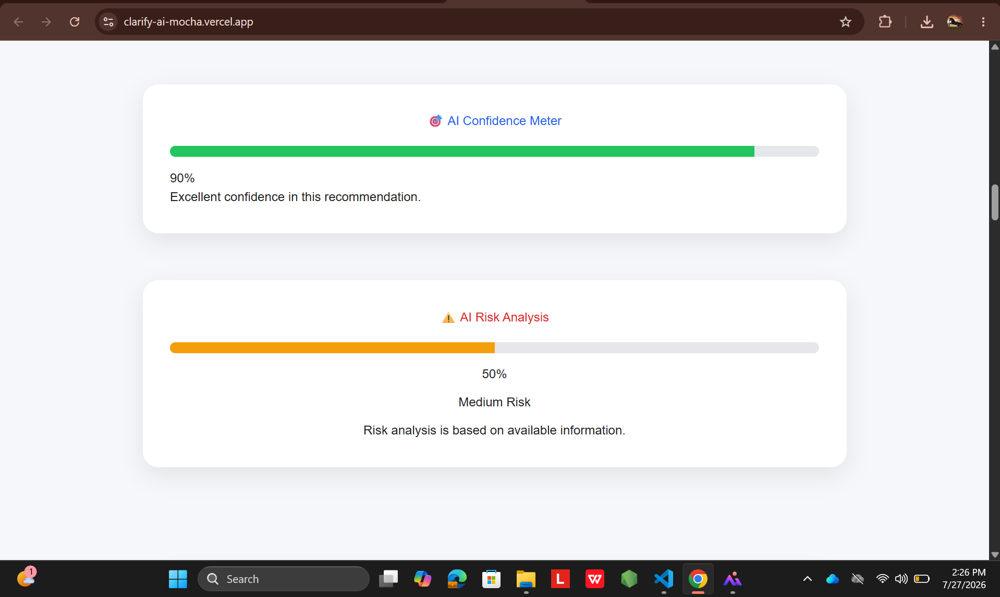

### 6. Roadmap
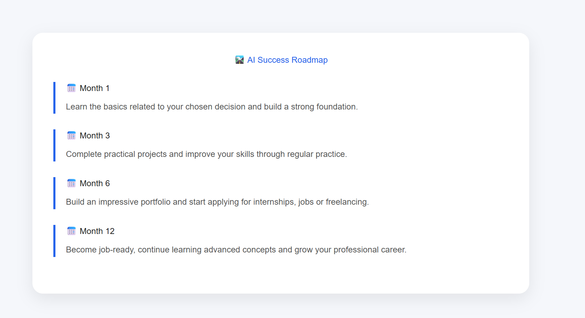

### 7. Download PDF
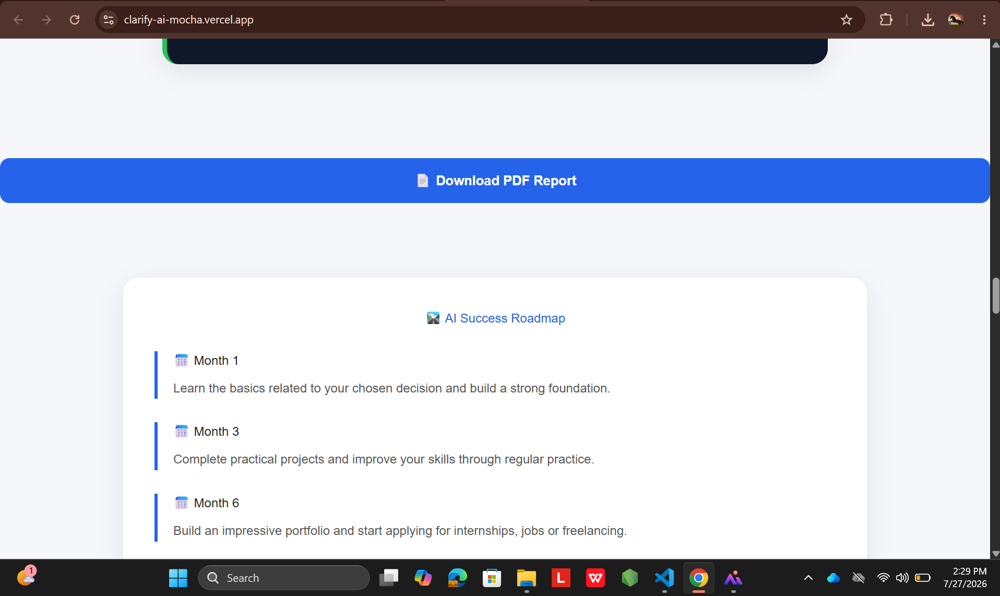

### 8. Decision History
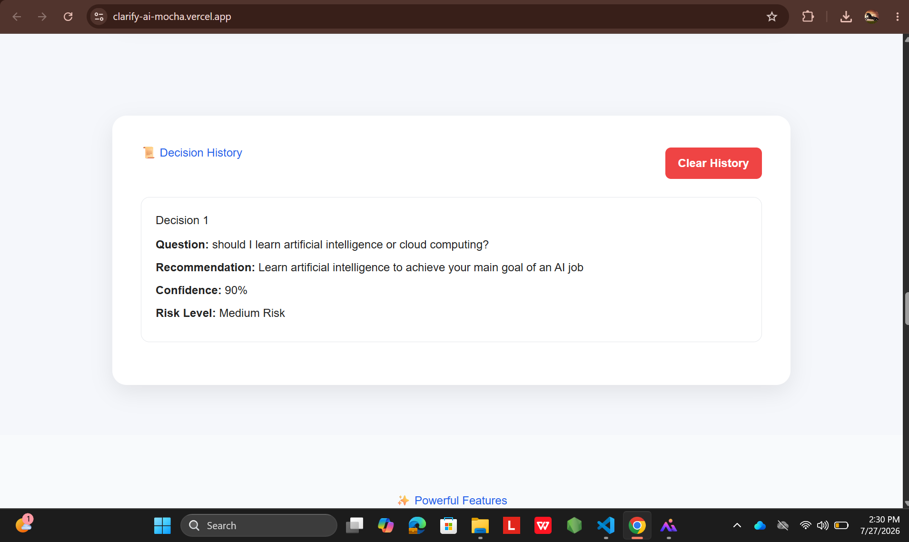

### 9. User Reviews
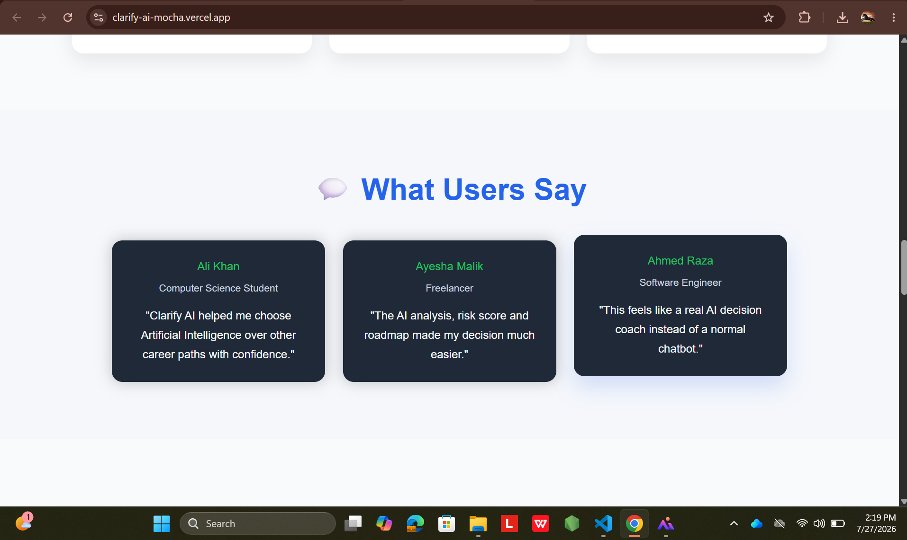

### 10. Powerful Features
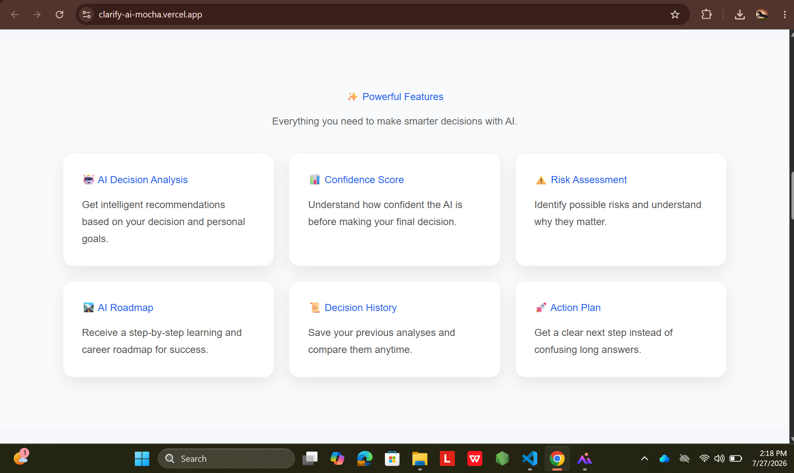

### 11. Contact Us Page

### 12. How It Works
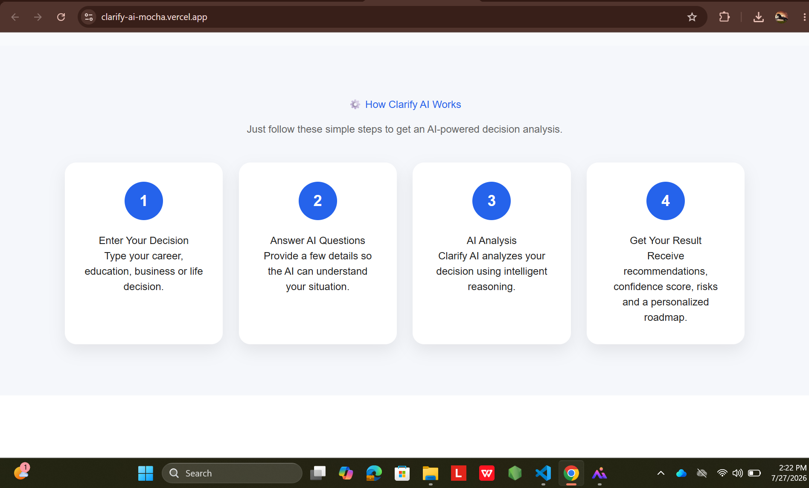

## 🏗️ Architecture Diagram

The application follows a modern three-tier architecture:

User
   ↓
React + Vite Frontend
   ↓
Node.js + Express Backend
   ↓
Groq API (Llama 3.3 70B)
   ↓
AI Response
   ↓
Frontend Dashboard
# 🔄 AI Workflow

1. User enters a decision.
2. Frontend sends the request to the backend.
3. Backend requests follow-up questions from the Groq API.
4. User answers the follow-up questions.
5. Backend generates a structured AI analysis.
6. The frontend displays the confidence score, risk analysis, roadmap, and final recommendation.
📂 Folder Structure
code
Text
clarify-ai/
├── frontend/              # React + Vite Frontend
│   ├── src/
│   │   ├── components/    # Reusable Components
│   │   ├── pages/         # Application Pages
│   │   ├── services/      # API Services
│   │   └── assets/        # Images and Assets
│   └── package.json
│
├── backend/               # Node.js + Express Backend
│   ├── routes/            # API Routes
│   ├── controllers/       # Business Logic
│   ├── middleware/        # Security & Validation
│   └── server.js
│
├── screenshots/           # Project Screenshots
├── README.md
├── LICENSE.md
└── package.json

## 🛠️ Tech Stack

| Category | Technology | Purpose |
|----------|------------|---------|
| Frontend | React 19, Vite | Modern and fast user interface |
| Styling | Tailwind CSS 4 | Responsive and professional UI design |
| Backend | Node.js, Express.js | REST API and backend services |
| AI API | Groq SDK | High-speed AI inference |
| AI Model | Llama 3.3 70B Versatile | AI-powered decision analysis |
| PDF Generation | jsPDF | Generate downloadable PDF reports |
| Email Service | EmailJS | Contact form and email integration |
| Routing | React Router DOM | Client-side navigation |
| Environment | dotenv | Secure environment variable management |
| Version Control | Git & GitHub | Source code management |
| Deployment | Vercel | Frontend hosting and deployment |
⚙️ Installation Guide
Prerequisites
Node.js (v18.0.0 or higher)
npm or yarn
A Groq API Key (Get one at console.groq.com)
Steps
Clone the repository:
code
Bash
git clone https://github.com/qasimbsf24003897/Clarify-AI.git
cd clarify-ai
Install Backend dependencies:
code
Bash
cd backend
npm install
Install Frontend dependencies:
code
Bash
cd frontend
npm install
🔑 Environment Variables
Create a .env file in the server directory:
code
Env
PORT=5000
GROQ_API_KEY=your_groq_api_key_here
NODE_ENV=development
🚀 Running Locally
Start the Backend Server:
code
Bash
cd backend
npm run server
Start the Frontend Development Server:
code
Bash
cd frontend
npm run dev
Open your browser:
Navigate to http://localhost:5173
🌐 Deployment
Frontend (Vercel)
The frontend is optimized for Vercel. Simply connect your GitHub repo and set the build command to npm run build and output directory to dist.
Backend
Can be deployed to Railway, Render, or any Node.js compatible PaaS. Ensure the GROQ_API_KEY is set in the production environment variables.
📖 Usage Guide
The Prompt: Enter a dilemma (e.g., "Should I invest in a Coding Bootcamp vs. Self-Study?").
The Clarification: Answer the 3 tailored questions the AI provides. Be as honest as possible.
The Analysis: Review your Confidence Score (how sure the AI is based on your data) and Risk Profile.
The Roadmap: Follow the generated phases (Immediate, Short-term, Long-term).
The Export: Download the PDF for your records or to show a mentor.
## 💡 Challenges Solved

- **AI Context Understanding:** Designed the AI workflow to ask follow-up questions before generating recommendations, improving response quality.

- **Multi-Step Decision Flow:** Managed user responses across multiple steps to provide structured and personalized analysis.

- **Fast AI Responses:** Integrated the Groq API with the Llama 3.3 70B model for low-latency decision analysis.
🚀 Future Improvements

Auth Integration: User accounts to sync history across devices.

Collaborative Decisions: Invite friends/colleagues to weigh in on a decision.

Multi-Model Comparison: Compare results from GPT-4o, Claude 3.5, and Llama.

Calendar Sync: Automatically add roadmap steps to Google/Outlook Calendar.
⚡ Performance

- Optimized React frontend for fast rendering.
- Efficient API communication with backend services.
- Responsive design across different devices.
🛡️ Security
Data Privacy: User inputs are processed via API and not stored permanently unless opted-in.
Sanitization: All user inputs are sanitized to prevent XSS.
API Security: Rate limiting implemented on the Express backend to prevent abuse.
🤝 Contributing
We welcome contributions from the community!
Fork the Project.
Create your Feature Branch (git checkout -b feature/AmazingFeature).
Commit your Changes (git commit -m 'Add some AmazingFeature').
Push to the Branch (git push origin feature/AmazingFeature).
Open a Pull Request.
❓ FAQ
Q: Is my data used to train the AI?
A: No. We use the Groq API with zero-retention policies for enterprise-grade privacy.
Q: Why does it ask questions instead of just answering?
A: Better data leads to better decisions. By gathering context first, Clarify AI avoids generic, unhelpful platitudes.
## 👤 Author

**Hafiz Muhammad Qasim Aziz**

- GitHub: https://github.com/qasimbsf24003897
## 🙏 Acknowledgements

This project would not have been possible without the amazing tools and technologies provided by the open-source community.

Special thanks to:

- **Groq** for ultra-fast AI inference.
- **Meta AI** for the Llama 3.3 70B Versatile model.
- **React** and *Vite* for providing a modern frontend development experience.
- **Node.js** and *Express.js* for powering the backend.
- **Vercel** for seamless frontend deployment.
- The **Open Source Community** for creating incredible libraries and resources that made this project possible.
## 📄 License

This project is licensed under the MIT License. See the LICENSE.md file for details.
